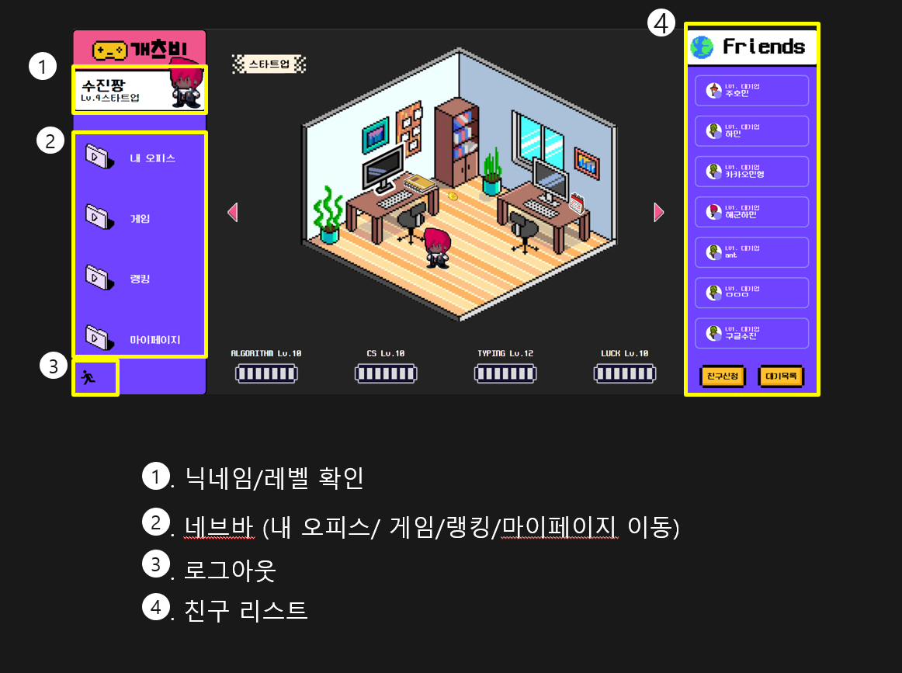
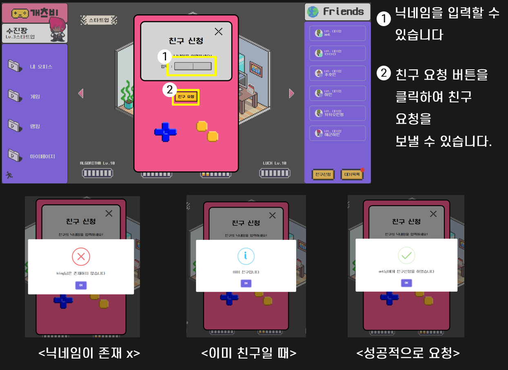
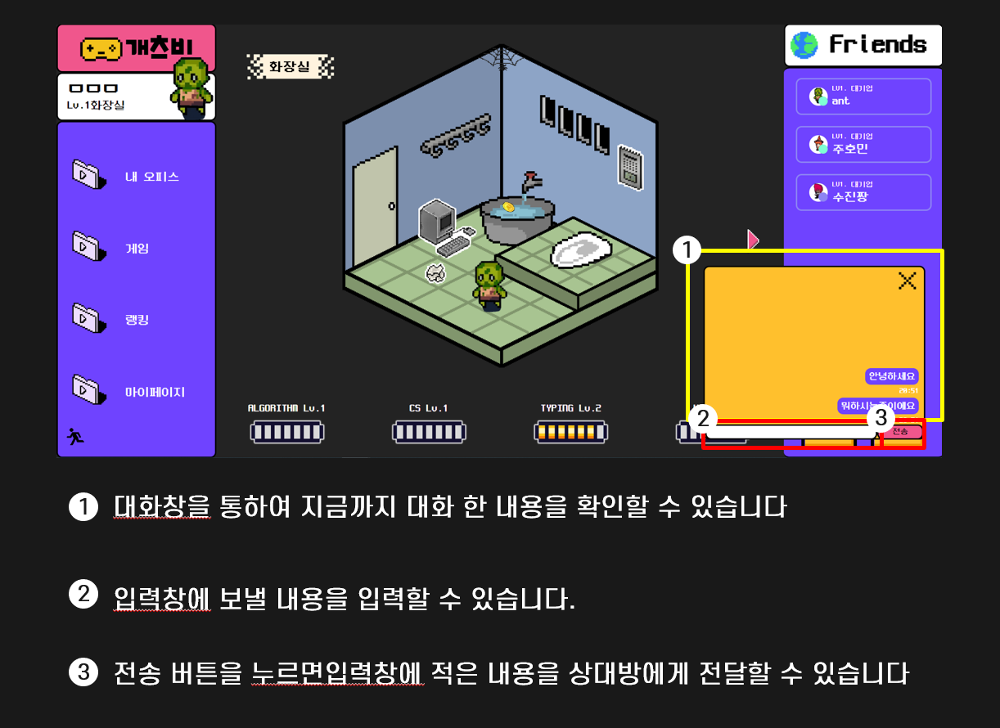
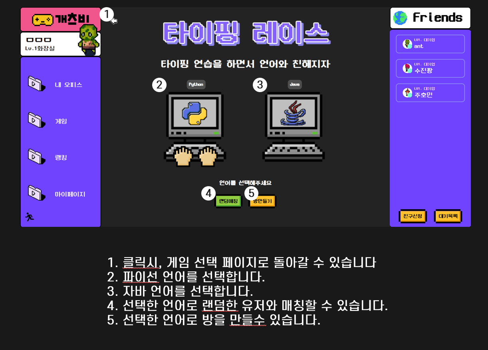
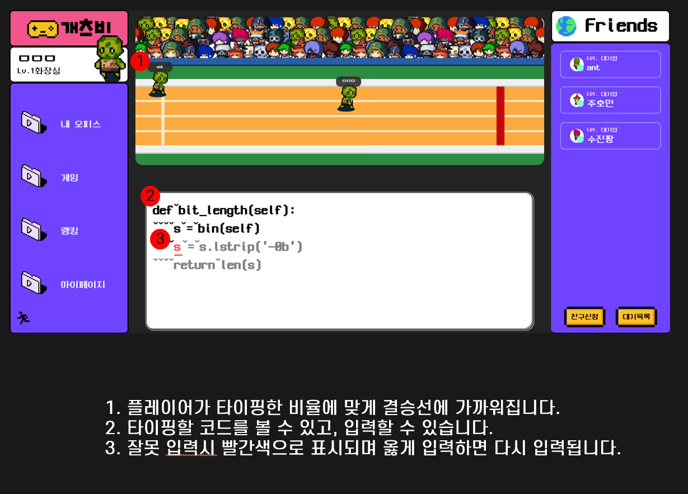
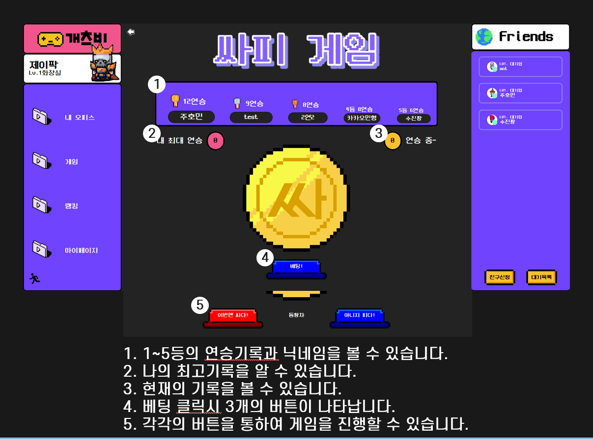
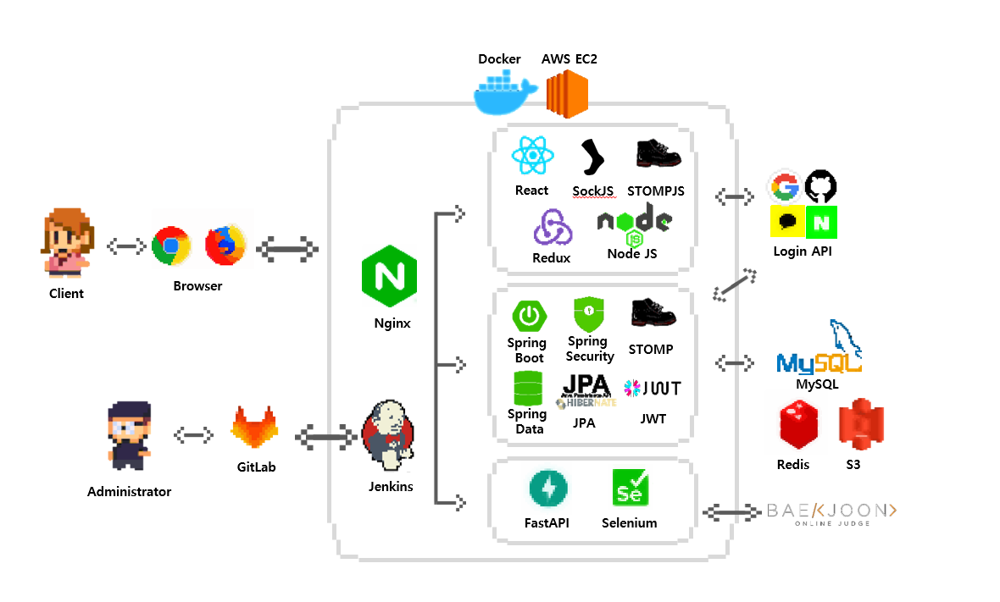
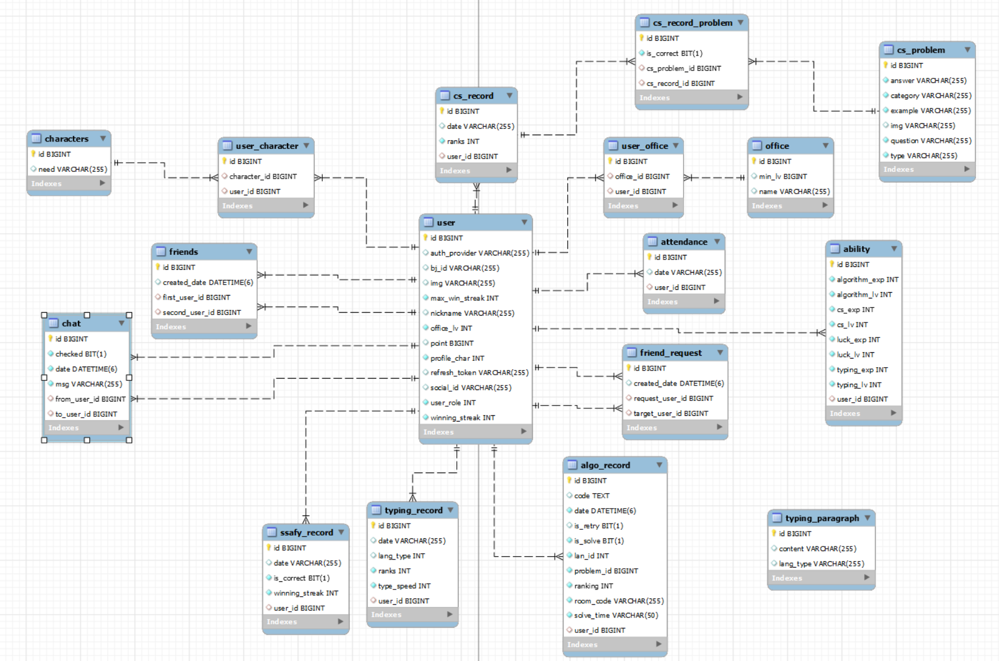

# 

📆 **프로젝트 진행기간 : 2022/10/10 ~ 2022/11/25**

**FE: 배준식, 석민형, 윤호준**

**BE: 권민용, 김수진, 이연의**
###  <br>
***
## 소개
***

### 지루한 CS공부 NO!

### 외로운 개발 공부 NO!

### 미루고 싶은 알고리즘 풀기 NO!

### 이젠 개츠비에서 함께 즐겁게 공부하고 취업준비 하세요.


###  <br>


#### 개츠비에선 회원들 끼리 재미있게 공부하기 위한 함께 '씨에스 파이트', 백준과 연동한 '알고리즘 배틀' 그리고 언어와 친숙 해지기 위한 '타이핑 레이스'와 잠시 쉬어가기 위한 '싸피 게임'을 제공 합니다.

###  <br>
***
## 주요 기능
***
- Office



- Friend

- Chatting


- TypingRace



- Algorithm Battle


- CS Fight


- ssafyGame


- myPage


---
## 개발 환경
---
###  Backend

- SpringBoot 2.7.5
- Java 11
- Gradle 7.5.1
- Type: Gradle
- Packiging: jar
- IntelliJ IDEA : 22.2.1
- MySQL Workbench: 8.0.28
- JPA
- JWT 0.11.2
- Lombok
- SWAGGER 2.9.2
- Spark-core : 3.3.0
- Redis 7.0.5
- FireBase 9.1.0
- Selenium 4.5.3
- FastAPI

###  Frontend

- ReactJs : 17.0.2
- React-Redux : 8.0.2
- Redux-Saga : 1.2.1
- Nodejs: 16.16.0
- Use-Upbit-Api : 1.1.3
- Axios : 1.1.3
- Sockjs : 1.6.1
- Stompjs : 2.3.3
- Typescript : 4.8.4


### CI/CD

- Amazon EC2 - Ubuntu 20.04
- Nginx - 1.18.0
- Docker - 20.10.21
- Jenkins - 2.361.2

### IDE

- vscode 1.70.1
- IntelliJ 2021.3.2

## 협업 툴
- Gitlab
- Jira
- [Notion](https://www.notion.so/PJT-E104-01d0d4394ab0412396877c8d60e15b8a)
- Figma
- Swagger
- Webex
- Google Sheet

 


---
## 컨벤션
---
### - Git 컨벤션

------

```################
# [Position] Type: message 의 형식으로 제목을 아래 공백줄에 작성
# 제목은 50자 이내 / 변경사항이 "무엇"인지 명확히 작성 / 끝에 마침표 금지    
#- Example
#    - Type 첫 글자는 대문자
#    - `Type:(공백)message` 공백 주의하여 작성
#    - message는 50자 내로 작성하고, 끝에 . (마침표) 사용 ❌
#    - `[FE: S07P12E104-12] Feat: 로그인 기능 구현`
# 바로 아래 공백은 지우지 마세요 (제목과 본문의 분리를 위함)

################
# 본문(구체적인 내용)을 아랫줄에 작성
# 여러 줄의 메시지를 작성할 땐 "-"로 구분 (한 줄은 72자 이내)
- 회원 정보 확인
- 토큰 발급 및 저장

################
# 꼬릿말(footer)을 아랫줄에 작성 (현재 커밋과 관련된 이슈 번호 추가 등)
# Jira Smart commit 사용 시 Jira 이슈 또한 종료할 수 있음.
# 예) Close #7

################
### Code 관련
# Add : 코드나 문자 추가
# Test : 테스트 코드 삽입
# Update : Fix와 달리 원래 정상적으로 동작한 기능의 보완 개념
# Fix : 버그 수정
# Remove : 코드 삭제
# Refactor : 결과의 변경 없이 코드 구조 재조정
#               Ex) createStore의 함수를 작은 함수로 분리
# Move : 코드나 파일의 이동
# Style : 서식, 세미콜론 누락
# Correct : 문법 오류, 타입 및 변수 이름 변경 등 수정 사항에 사용

### 기능 관련
# Feat : 새로운 기능 추가
# Improve : 호환성, 테스트 커버리지(테스트 케이스가 얼마나 충족 한지), 접근성 향상
# Chore : 기타 작업, 빌드 작업, 패키지 관리자 구성 등 업데이트, Production Code 변경 없음
# Test : git 관련 테스트 혹은 코드 관련 테스트 진행

### 파일, 폴더 관련
# Docs : 문서 변경 (문서 추가, 이름 변경 등)
# Move : 코드나 파일의 이동
# Rename : 이름 변경
# Create : 파일이나 폴더 추가
################

```


### - 브랜치 구조
```
|-- master
		|-- release
		    |-- dev/front
		        |-- feat-FE/feature1
		        |-- feat-FE/feature2
		
		    |-- dev/back
		        |-- feat-BE/feature1
		        |-- feat-BE/feature2

                
                
# 원격 저장소 갱신
$ git remote update

# 원격저장소의 브랜치 목록 확인
$ git branch -r

# 원격저장소의 branch 가져오기
$ git checkout -t origin/dev/back
```
---
## 서비스 아키텍처
---


---
## ERD
---


***
## Manual
***
### exec/포팅 메뉴얼/포팅 메뉴얼.pdf 참고