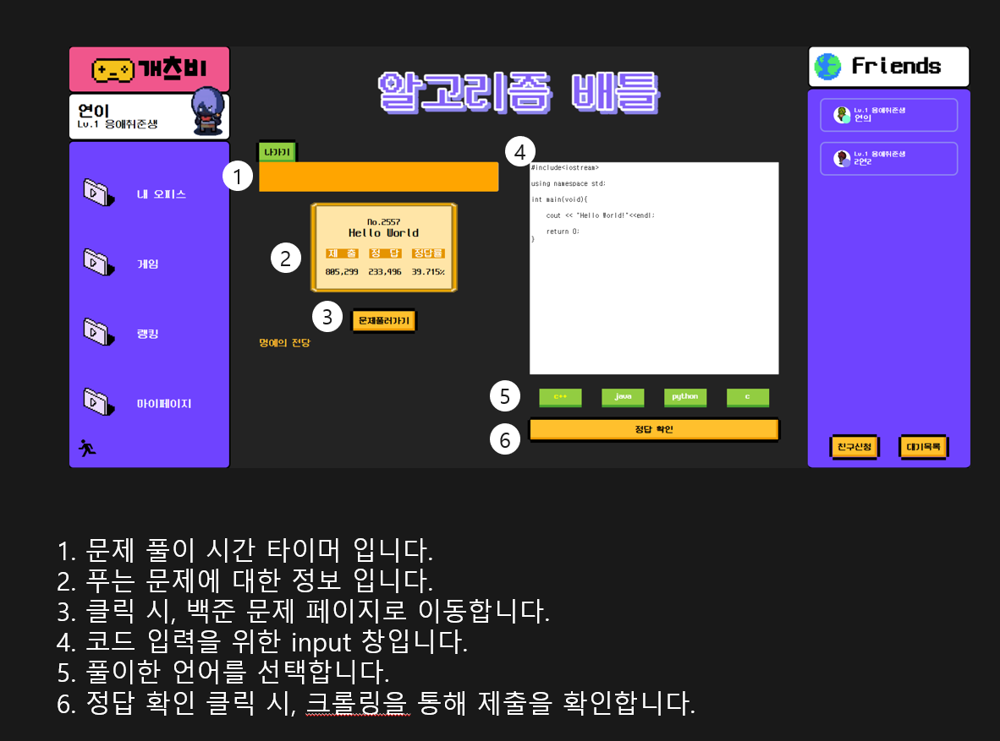
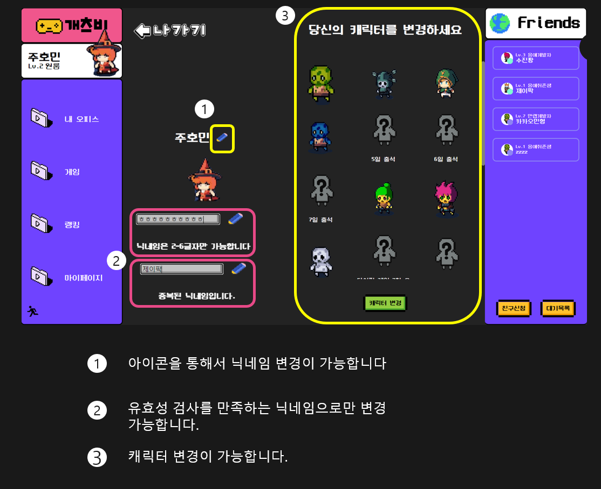

# 

📆 **프로젝트 진행기간 : 2022/10/10 ~ 2022/11/25**

**FE: 배준식, 석민형, 윤호준**

**BE: 권민용, 김수진, 이연의**
###   
***
## 소개
***

### 지루한 CS공부 NO!

### 외로운 개발 공부 NO!

### 미루고 싶은 알고리즘 풀기 NO!

### 이젠 개츠비에서 함께 즐겁게 공부하고 취업준비 하세요.

###   

#### 개츠비에선 회원들 끼리 재미있게 공부하기 위한 함께 '씨에스 파이트', 백준과 연동한 '알고리즘 배틀' 그리고 언어와 친숙 해지기 위한 '타이핑 레이스'와 잠시 쉬어가기 위한 '싸피 게임'을 제공 합니다.

###   
***
## 구현 기능
1. CS 퀴즈 기능 구현

2. 코드 타이핑 멀티플레이어 게임 제작

3. 친구 기능

4. 게임 기록, 회원별 아이템, 회원 정보, 출석체크, 친구 기능 등의 Rest API 구현

***
## 주요 기능
***
- Office

- Friend

- Chatting

- TypingRace

- Algorithm Battle

- CS Fight

- ssafyGame

- myPage

---
## 개발 환경
---
###  Backend

- SpringBoot 2.7.5
- Java 11
- Gradle 7.5.1
- Type: Gradle
- Packiging: jar
- IntelliJ IDEA : 22.2.1
- MySQL Workbench: 8.0.28
- JPA
- JWT 0.11.2
- Lombok
- SWAGGER 2.9.2
- Spark-core : 3.3.0
- Redis 7.0.5
- FireBase 9.1.0
- Selenium 4.5.3
- FastAPI

###  Frontend

- ReactJs : 17.0.2
- React-Redux : 8.0.2
- Redux-Saga : 1.2.1
- Nodejs: 16.16.0
- Use-Upbit-Api : 1.1.3
- Axios : 1.1.3
- Sockjs : 1.6.1
- Stompjs : 2.3.3
- Typescript : 4.8.4

### CI/CD

- Amazon EC2 - Ubuntu 20.04
- Nginx - 1.18.0
- Docker - 20.10.21
- Jenkins - 2.361.2

### IDE

- vscode 1.70.1
- IntelliJ 2021.3.2

## 협업 툴
- Gitlab
- Jira
- [Notion](https://www.notion.so/PJT-E104-01d0d4394ab0412396877c8d60e15b8a)
- Figma
- Swagger
- Webex
- Google Sheet

