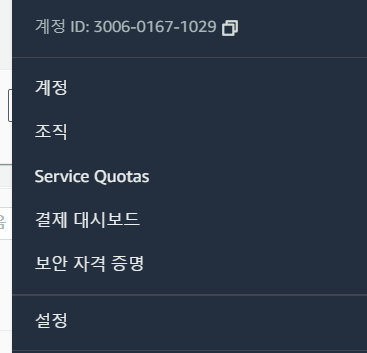
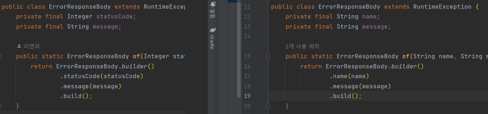
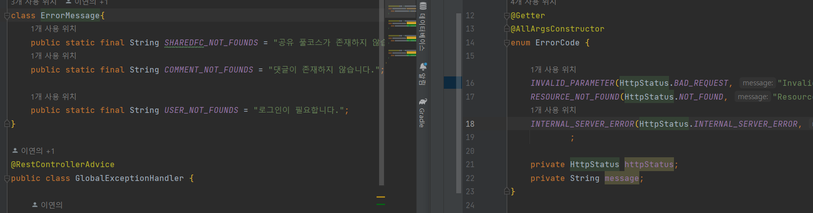
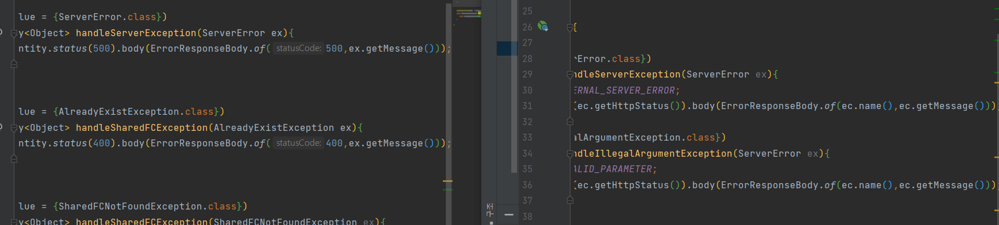

# 스프링 프로젝트 생성

- 이전의 **DDD(Domain Driven Design) 디렉토리 구조**를 채택.
  - 협업을 할 때 대부분 도메인 별로 나눠서 작업하기 때문에, 도메인별로 디렉토리를 나누니까 효율적으로 작업할 수 있었음.
  - 또한, 도메인별로 나누니까 각 파일들의 위치를 찾는 것도 더 쉬웠고 효율적이었음.

- 풀코스 백엔드를 회고/정리하면서 스프링 프로젝트 생성함.

---

### Build.gradle

- java: 11
- spring boot: 2.7.5
- dependencies: dataJPA, security, web, websocket, lombok, swagger, jwt, json, aws, querydsl

---

### env.properties

##### 1. dp

- url은 로컬로 설정
- username, password는 `ssafy`

##### 2. 로깅레벨: 디버그

##### 3. ~~ant_path_matcher : 이전 풀코스 프로젝트 때 swagger에서였나? 오류생겨서 넣었음.

##### 4. jwt

- properties.file.secret: jwt를 만들기 위한 비밀키 인듯? 무작위로 

##### 5. aws



- aws 계정>보안 자격 증명> accesskey/secretkey 발급
- bucket: chukkachukka (새로 만들기가 귀찮아서 원래껄루~)

---

### application.properties


---

### 구조

### 🔸 Domain

- algorithm | comscience | magakko | typing | user

### 🔸 global

#### 	🔹 error

##### 		> errorResponseBody.java  서버 ->클라이언트에 에러를 담아 보낼 DTO

> ##### 수정한 부분
>
> - statusCode는 없애고 name으로 바꿈.
>
> 

##### 		> GlobalExceptionHandler.java

> ##### 수정한 부분
>
> - 클래스를 enum으로 바꾸고, name/httpStatus/message 가 들어가도록 수정
>
> 
>
> - 상태코드를 임의로 주던 걸 -> 각 예외들에 대해서 enum에서 정의한 httpstatus 상태코드를 줌
> - body에 상태코드가 아닌 name을 넣어줌.
>
> 

#### 		🔹 model

##### 				> ~~BaseResponseBody.java~~ -> 없앨 것

> - BaseResponseBody를 없애고 ResponseEntity의 body에 바로  dto 넣을 것 
>
> ```java
> return ResponseEntity.ok()
>         .headers(headers)
>         .body(moveResponseDto);
> ```

#### 		🔹 config

##### 				> AmazonS3Config

> 

#### 		🔹 config

##### 				> AmazonS3Config

> 