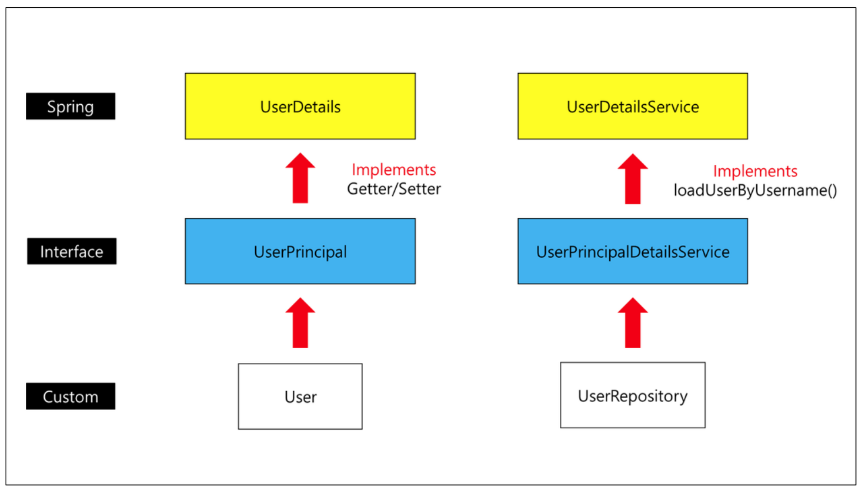

## Kakao Login

카카오 API를 사용하기 위한 파라미터

- Token Name : kakao rest API (적고 싶은 것을 적어준다.)
- Callback URL : Authorization Code 방식으로 토큰 발급을 받는 url을 적는 곳이다. 위에서 Redirect URI 부분에 추가가 되어야 한다. 안되면 006 Error 뜬다. (postman에서 실습하기 때문에, postman 주소로 적어준것이다. 백엔드 있으면 백엔드 주소 적어준다.)
- Auth URL : OAUTH를 지원해 주는 서버에 로그인을 하기 위해 적는다.( https://kauth.kakao.com/oauth/authorize )
- Access Token URL : 발급 받은 인증 코드를 포함하여 req 하여 res로 token을 받기 위한 URL이다. ( https://kauth.kakao.com/oauth/token )

- Client ID: Rest API 키
- Client Secret: 필수는 아니고, 보안을 위해서 필요한 코드

##### properties 추가

- 카카오, 네이버 로그인을 위한 설정을 해줌
- google은 spring boot에 자체적으로 등록이 되어 있어서 생략 가능

```properties
# OAuth (kakao)
spring.security.oauth2.client.provider.kakao.authorization-uri= https://kauth.kakao.com/oauth/authorize
spring.security.oauth2.client.provider.kakao.token-uri= https://kauth.kakao.com/oauth/token
spring.security.oauth2.client.provider.kakao.user-info-uri= https://kapi.kakao.com/v2/user/me
spring.security.oauth2.client.provider.kakao.user-name-attribute= id
spring.security.oauth2.client.registration.kakao.client-id= ${java.file.kakao-api}
spring.security.oauth2.client.registration.kakao.redirect-uri= https://localhost/login/oauth2/code/kakao
spring.security.oauth2.client.registration.kakao.scope= {profile, account_email}
spring.security.oauth2.client.registration.kakao.authorization-grant-type= authorization_code
spring.security.oauth2.client.registration.kakao.client-authentication-method= POST
spring.security.oauth2.client.registration.kakao.client-name= Kakao

# OAuth (Naver)
spring.security.oauth2.client.provider.naver.authorization-uri= https://nid.naver.com/oauth2.0/authorize
spring.security.oauth2.client.provider.naver.token-uri= https://nid.naver.com/oauth2.0/token
spring.security.oauth2.client.provider.naver.user-info-uri= https://openapi.naver.com/v1/nid/me
spring.security.oauth2.client.provider.naver.user-name-attribute= response
spring.security.oauth2.client.registration.naver.client-id= ${java.file.kakao-api}
spring.security.oauth2.client.registration.naver.redirect-uri= https://localhost/login/oauth2/code/naver
spring.security.oauth2.client.registration.naver.scope= {name, email}
spring.security.oauth2.client.registration.naver.authorization-grant-type= authorization_code

```

#### Spring Boot Flow

1. `OAuth2LoginAuthenticationFilter`에서 OAuth2 로그인 과정이 수행됨
2. OAuth2 Filter 단에서 직접 커스텀한 OAuth2 Service의 `loadUser` 메소드가 실행됨.
3. 로그인을 성공하게 되면 Success Handler의 `onAuthenticationSuccess` 메소드 실행됨.
4. Success Handler에서 최초 로그인 확인 및 JWT 생성 및 응답 과정이 실행됨.


#### Security Config 설정

- `.oauth2Login().loginPage("/login")` – OAuth2 로그인 설정에서 로그인 페이지 URL을 수동으로 변경합니다. 여기서는 기존 URL과 동일한 URL을 사용합니다.

#### UserDetails, UserDetailsService

